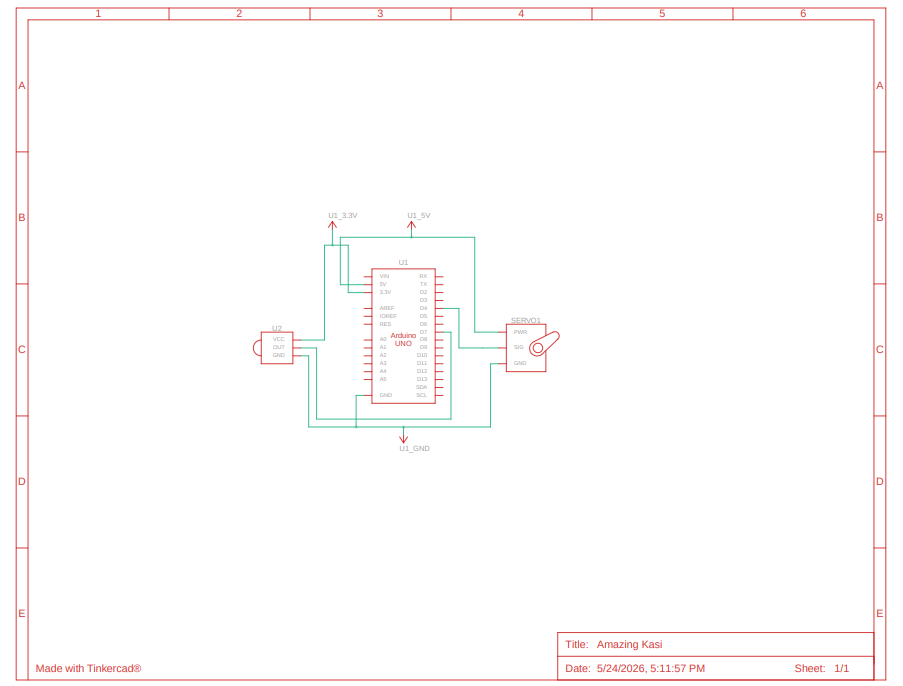

# Light Turner using Arduino Uno, IR Receiver Module, IR Remote Control and SG90 Servo

I was having some annoyance reading at night (I was reading Golden Son and Morning Start). I needed the light to be on to read but the pain of getting out of my bed and turning it off was irritating. So, armed with an arduino starter kit, I drafted a solution to my first world problem. I needed something that would allow me to turn off the light without ever getting up. Here is my solution:

# Specs:

### Hardware:

| Component | Quantity |
| :--- | :---: |
| Arduino Uno R3 Microcontroller | 1 |
| VS1838B IR Receiver Sensor | 1 |
| Handheld IR Remote Control | 1 |
| SG90 Micro Servo Motor | 1 |
| Portable 5V USB Power Bank | 1 |
| Female-to-Male Dupont Jumper Wires | 3 |
| Male-to-Male Breadboard Jumper Wires | 3 |
|USB-Cable| 1 |

### Software and Dependencies

|Software & External Libraries|
| :---: |
| Arduino IDE|
| Servo Library|
| IRRemote Libary|

### Schematic

### Demo

Here is a Youtube Shorts demoing the functionality of the project

Here is a picture of the hardware set up

